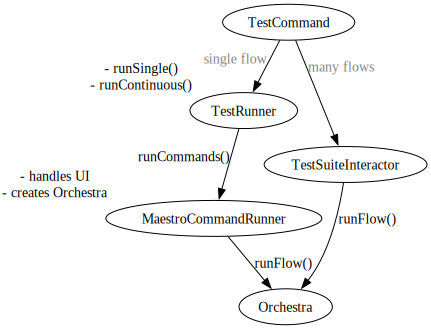

### Notes

- There's lots of duplication between `MaestroCommandRunner` and
  `TestSuiteInteractor`
  - `takeDebugScreenshot()`
  - `Orchestra` instance creation and callbacks setup

- `TestDebugReporter.logSystemInfo()` and `DebugLogStore.logSystemInfo()` are
  duplicated

- Lack of clear defintion:
  - test vs flow? Flow run, test suite run but `TestSuiteInteractor`?

sharding idea:
- when 1 device is active, but `--shards 2` is passed, print info:
  "requested 2 shards but detected only 1 active device."
