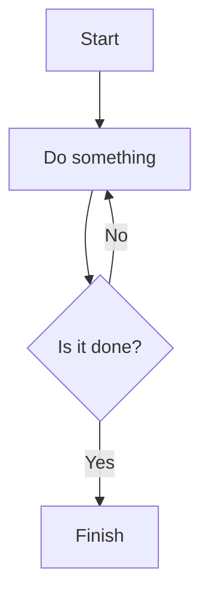

playing around with mermaid graphs

run:

```console
mmdc -i input.mmd -o output.svg
```


```mermaid
graph TD
    A[Start] --> B[Do something]
    B --> C{Is it done?}
    C -->|Yes| D[Finish]
    C -->|No| B

```

- TD is top-down graph
