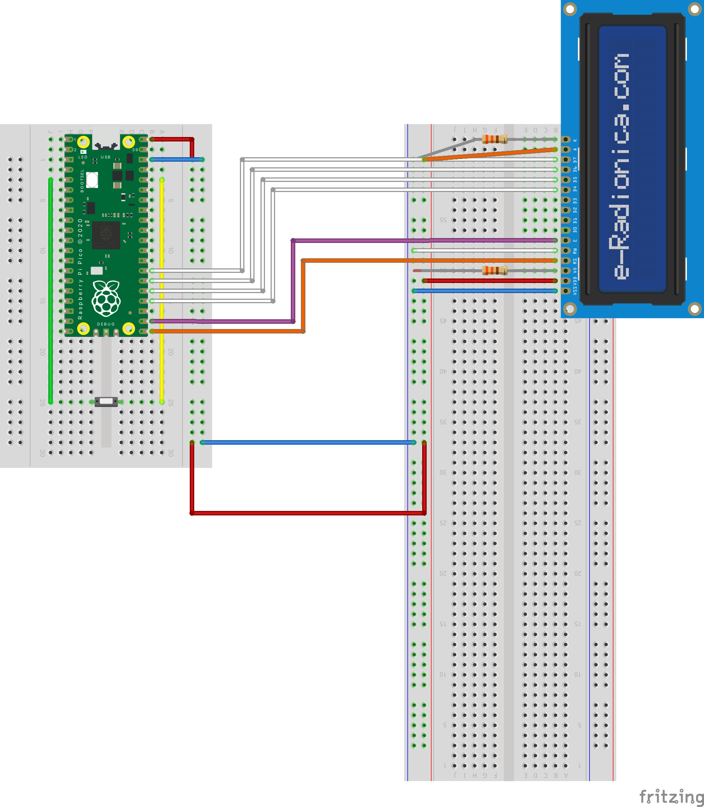

# pi pico

basics:

The pico has 2 modes:
- flash modes. To enter it, hold BOOTSEL while plugging the microcontroller into
  PC
- normal run mode

links:
- [wiring](https://www.raspberrypi.com/documentation/microcontrollers/pico-series.html#pico-1-technical-specification)

# pi pico project

The project I made for the "Laboratory of Microprocessor Technology" on the 7th
semester.

Project is in contained in the single file: `lcd.py`.

Attached is `project.fzz` - the fritzing schema.

